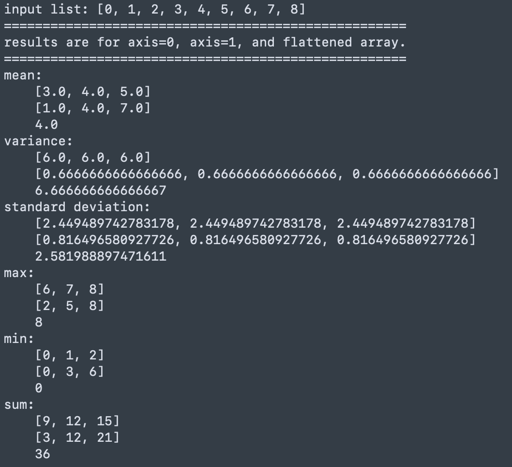
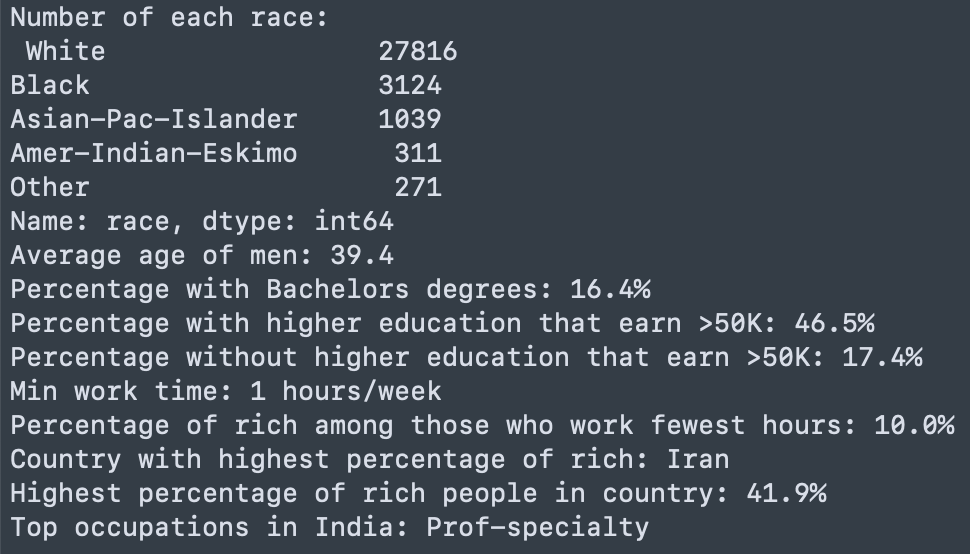
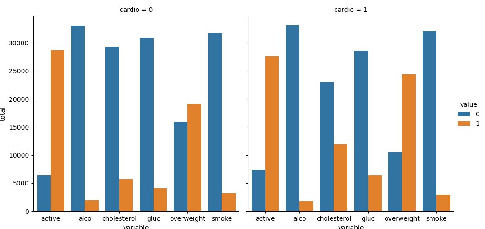
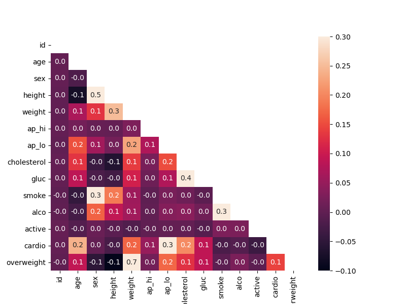
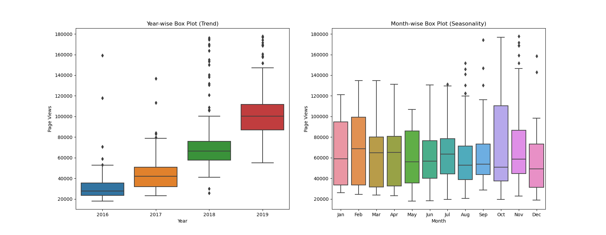
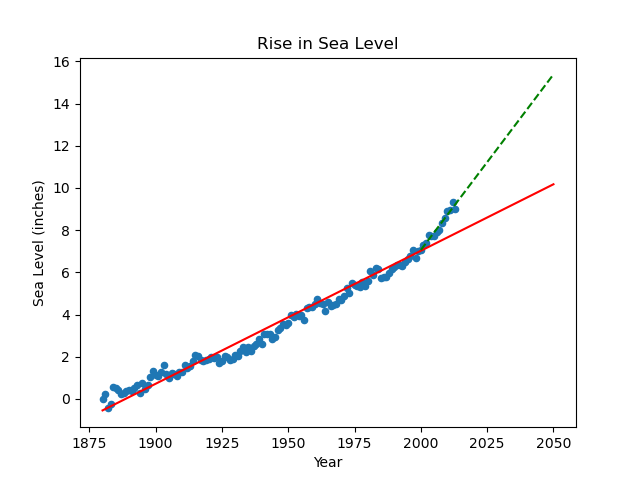

# FreeCodeCamp Data Analysis with Python Projects

## Mean Variance Standard Deviation Calculator 

  Project description and the boilerplat code can be found at [FreeCodeCamp](https://github.com/freeCodeCamp/boilerplate-mean-variance-standard-deviation-calculator).

  

## Demographic Data Analyzer

  Project description and the boilerplat code can be found at [FreeCodeCamp](https://github.com/freeCodeCamp/boilerplate-demographic-data-analyzer).

  

## Medical Data Visualizer 

  Project description and the boilerplat code can be found at [FreeCodeCamp](https://github.com/freeCodeCamp/boilerplate-medical-data-visualizer).

  
  

## Page View Time Series Visualizer

  Project description and the boilerplat code can be found at [FreeCodeCamp](https://github.com/freeCodeCamp/boilerplate-page-view-time-series-visualizer).

  
  

## Sea Level Predictor

  Project description and the boilerplat code can be found at [FreeCodeCamp](https://github.com/freeCodeCamp/boilerplate-sea-level-predictor).

